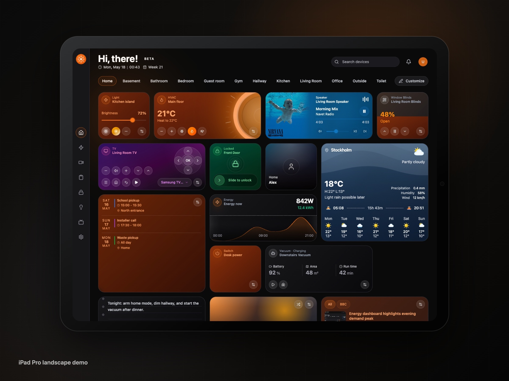
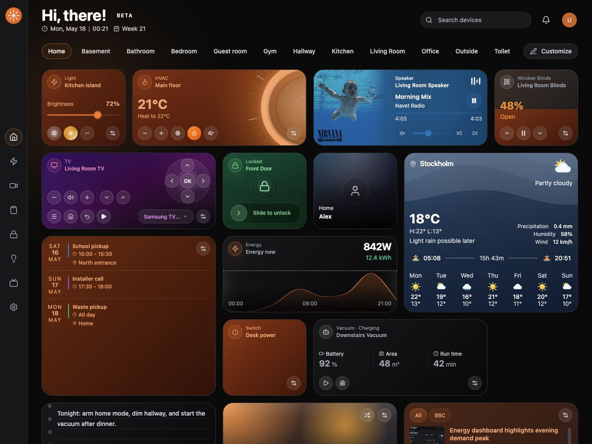
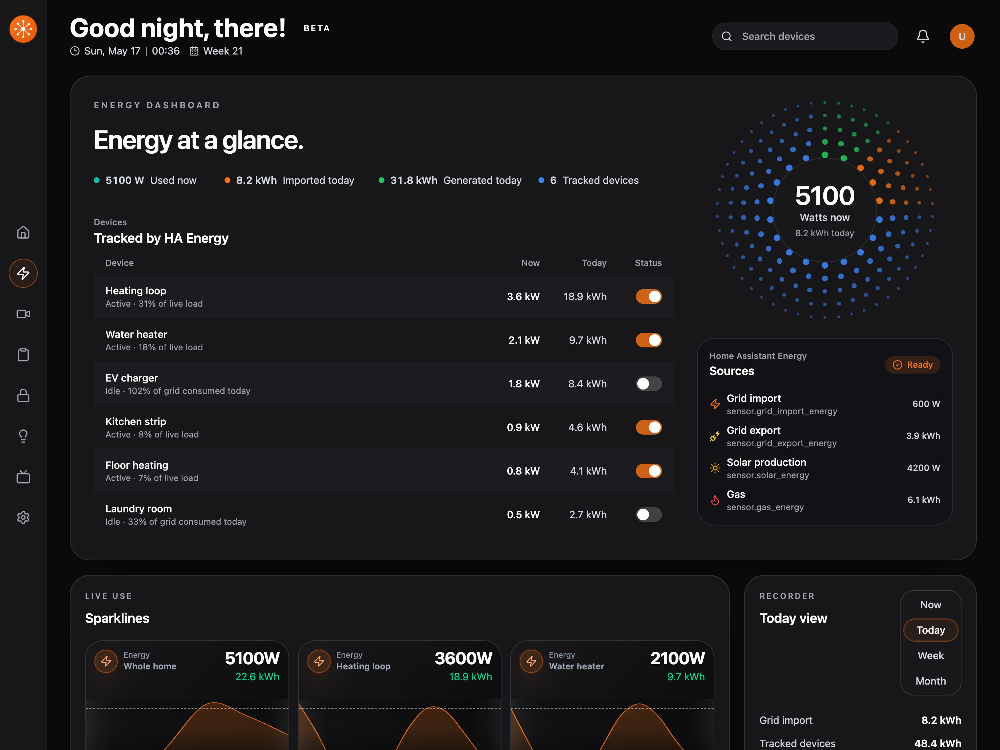
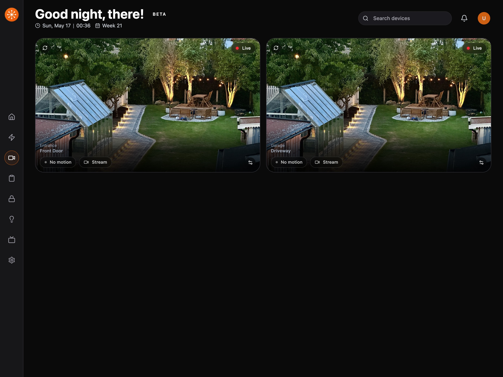
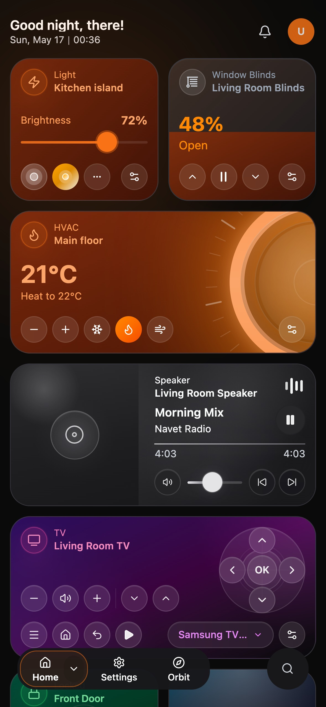

# Navet

A smart-home dashboard frontend for wall panels, tablets, phones, and desktop screens.



[Live demo](https://navet.app/demo/) ·
[Storybook](https://navet.app/storybook/) ·
[Docs](docs/README.md) ·
[Security policy](SECURITY.md) ·
[Code of conduct](CODE_OF_CONDUCT.md)

## What Navet Is

Navet turns supported smart-home platforms into a dedicated control surface with a room-first home
dashboard plus focused `energy`, `climate`, `security`, `lights`, `media`, `tasks`, and
`settings` sections.

Home Assistant is the reference provider today, but Navet is not a Home Assistant-only frontend.
The repo is organized around provider-neutral `@navet/core` and `@navet/ui` packages, provider
packages, an `@navet/app` composition layer, and thin app workspaces for each runtime surface.

## Provider Status

|  | Provider | Status | Runtime modes |
|---|---|---|---|
|  | Home Assistant | implemented | custom panel, add-on, standalone |
|  | Homey | implemented | standalone |
|  | openHAB | implemented | standalone |
|  | Hubitat | scaffolding only | not available yet |
|  | SmartThings | scaffolding only | not available yet |

## What You Get

- room-driven dashboards with dedicated views for energy, climate, security, lights, media, tasks, and settings
- cards for common smart-home entities including lights, switches, fans, climate, covers, locks, cameras, media, weather, people, scenes, and vacuums
- dashboard editing with ordering, sizing, locking, visibility, room assignment, and import/export
- custom widgets including RSS, photo, note, battery, UPS, energy-now, button, and map
- PWA install support, themes, localization, and persisted app state for standalone and add-on deployments

## Getting Started

Choose the setup guide that matches your provider and deployment mode:

### Home Assistant

- [Custom panel via HACS (`awesomestvi/navet-hacs`, type `Integration`)](docs/HOME_ASSISTANT.md#home-assistant-custom-panel)
- [Add-on repository via Home Assistant Add-on Store (`awesomestvi/navet`)](docs/HOME_ASSISTANT.md#home-assistant-add-on)
- [Standalone Docker](docs/HOME_ASSISTANT.md#standalone-docker)

### Homey

- [Standalone setup](docs/HOMEY.md)

### openHAB

- [Standalone setup](docs/OPENHAB.md)

## Development

Prerequisites:

- Node.js `^20.19.0` or `>=22.12.0`
- pnpm `11.5.0` from the pinned `packageManager`

Install dependencies and start the Vite app:

```bash
pnpm install
pnpm dev
```

Open the local URL shown by Vite, usually `http://localhost:5173`.

For local provider testing:

- Home Assistant: enter the base URL in Navet and complete OAuth
- Homey: configure the required OAuth environment variables, then use the Homey login option
- openHAB: use the openHAB login option and provide the base URL plus username/password

## Package Architecture

Navet’s reusable package layout is:

```text
packages/
  core/
  ui/
  provider-homeassistant/
  provider-homey/
  provider-openhab/
  provider-hubitat/
  provider-smartthings/
  app/
```

Deployable and published surfaces live under `apps/`:

```text
apps/
  standalone/
  ha-panel/
  storybook/
  demo/
  website/
```

Home Assistant release surfaces and shared static assets live outside `apps/`:

```text
platform/
  home-assistant/
    addons/
    custom_components/

assets/
  public/
  reference/
    marketing/
    media/
    wallpapers/
      source/
```

Contributor mental model:

- `@navet/core` owns shared contracts, IDs, and adapter semantics
- `@navet/ui` owns provider-neutral React UI
- provider packages own provider-specific runtime, auth, mapping, and command translation
- `@navet/app` owns runtime selection, provider registration, settings, persistence, and product wiring
- `apps/*` own host-specific bootstrapping, build config, and publishing surfaces

The repo still contains migration seams and app-internal compatibility code, but package ownership
is the right default model for new work.

## Commands

Common local commands:

```bash
pnpm dev
pnpm test
pnpm test:tier1
pnpm test:tier2
pnpm test:tier3
pnpm storybook
pnpm storybook:build
pnpm check:stories
pnpm check:ui-kit
pnpm check:docker
pnpm build:ha-panel
```

Contributor policy lives in [docs/agents/commands.md](docs/agents/commands.md). In particular,
`pnpm typecheck` and `pnpm check` are user-run gates rather than default agent-run commands.

## Docs

Start with [docs/README.md](docs/README.md).

Useful entry points:

- [Home Assistant deployment guide](docs/HOME_ASSISTANT.md)
- [Homey setup guide](docs/HOMEY.md)
- [openHAB setup guide](docs/OPENHAB.md)
- [Widgets guide](docs/WIDGETS.md)
- [Architecture overview for contributors](docs/agents/architecture.md)
- [Package boundaries](docs/architecture/package-boundaries.md)
- [Provider testing strategy](docs/testing/provider-testing-strategy.md)
- [Roadmap](docs/ROADMAP.md)
- [Release workflow](docs/release-workflow.md)

## Screenshots

| Home | Energy | Security |
|---|---|---|
|  |  |  |

| Tablet | Mobile home | Mobile controls |
|---|---|---|
|  |  |  |
