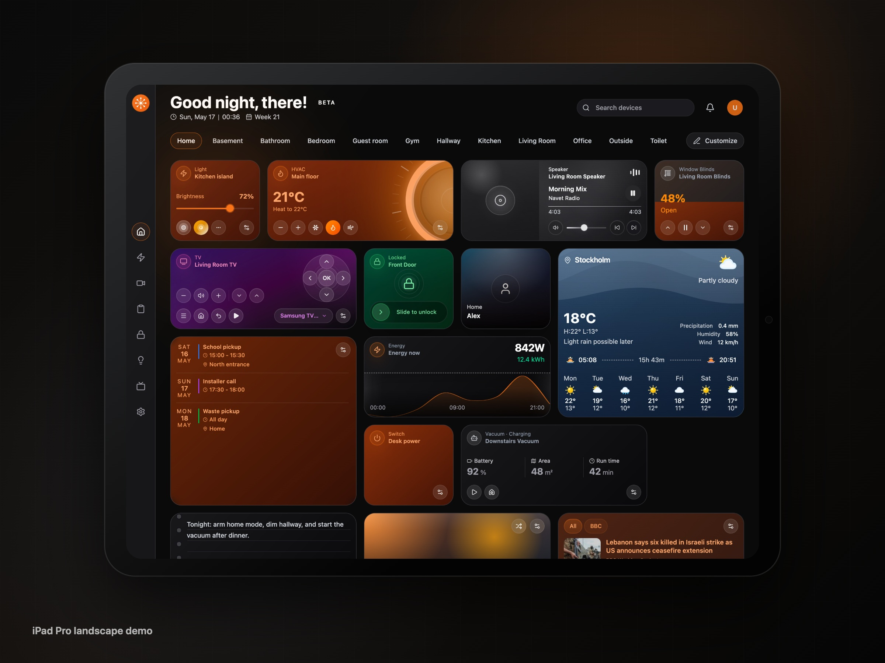
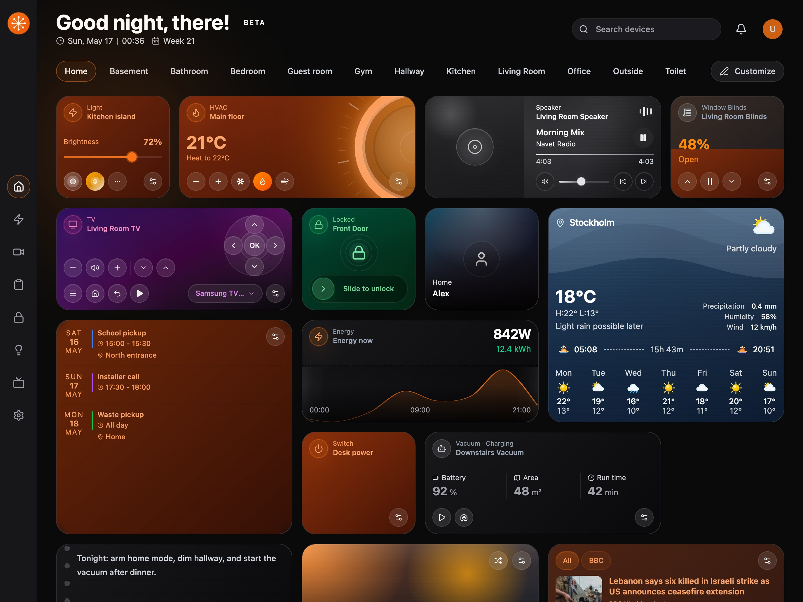
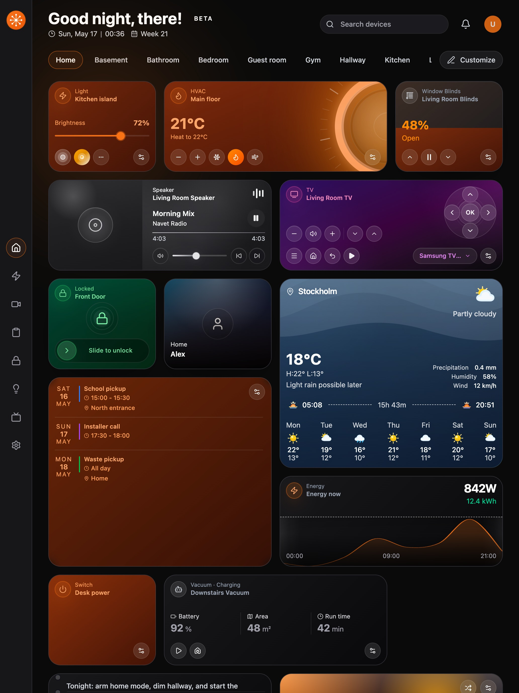
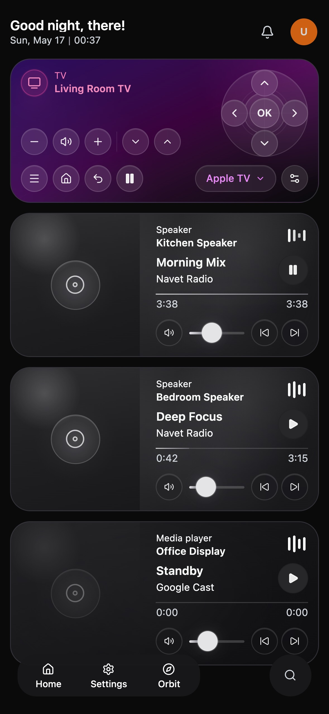

# Navet

A polished Home Assistant dashboard for wall panels, tablets, phones, and desktop screens.



[Live demo](https://awesomestvi.github.io/navet/demo/) ·
[Storybook](https://awesomestvi.github.io/navet/storybook/) ·
[Get started](#get-started) ·
[Security notes](docs/PUBLIC_LAUNCH_SECURITY.md)

Navet turns Home Assistant into a dedicated smart home control surface. Use it for the devices and
rooms you touch every day: lights, media, cameras, locks, energy, automations, weather, calendars,
sensors, and custom dashboard widgets.

Current release: `0.1.3`

## Why Navet

- **Made for shared screens.** Navet is designed for wall panels, tablets, family devices, and
  always-on dashboard displays.
- **Works with your Home Assistant setup.** Run it as a native Home Assistant custom panel, a Home
  Assistant add-on, or a standalone Docker container connected to your Home Assistant instance.
- **Easy to shape around your home.** Arrange rooms, resize cards, rename widgets, lock cards,
  reorder devices, add widgets, and keep the dashboard focused on the controls you actually use.
- **Self-hosted by design.** Your Home Assistant URL, token, entity state, and camera feeds stay in
  your own environment.
- **Installable app experience.** Use Navet as a PWA on supported devices for a focused dashboard
  instead of a normal browser tab.

## Features

### Home dashboard

- Room-based navigation with an `All` overview and per-room views
- Editable entity cards with ordering, room assignment, visibility, card locking, and card sizing
- Custom widgets for notes, photos, RSS/news, battery status, energy, buttons, and maps, including
  editable names and per-widget settings
- Import/export support for local dashboard configuration

### Smart home sections

- **Energy:** usage overview, current demand, historical trends, setup flow, and energy widgets
- **Security:** cameras, covers with direct position gestures, lock cards, and security-focused layouts
- **Lighting:** lights, switches, scenes, and room-oriented control
- **Media:** grouped media players with dedicated audio and TV handling
- **Tasks:** Home Assistant automation summaries grouped into actionable sections
- **Daily context:** weather with source-aware temperature units, calendars, people/presence, sensors,
  vacuums, and RSS feeds

### Interface and customization

- Responsive layout for mobile, tablet, wall panel, and desktop use
- Appearance, localization, interaction, dashboard, system, and project settings
- Theme helpers and readable card surfaces for a consistent dashboard look
- PWA support for an app-like dashboard experience on supported devices

## Screenshots

| Home | Energy | Security |
|---|---|---|
|  |  |  |

| Tablet | Mobile home | Mobile controls |
|---|---|---|
|  |  |  |

## Try the Demo

Open the public beta demo:

[https://awesomestvi.github.io/navet/demo/](https://awesomestvi.github.io/navet/demo/)

The demo uses fake `/demo` data. It does not connect to a real Home Assistant instance.

Review the public Storybook:

[https://awesomestvi.github.io/navet/storybook/](https://awesomestvi.github.io/navet/storybook/)

## Get Started

Choose the setup that matches where you want Navet to live. For Home Assistant OS and Supervised
users, the HACS custom panel path is the recommended Home Assistant-native setup.

### Home Assistant custom panel with HACS

For the native Home Assistant sidebar experience, install Navet as a HACS custom integration. Home
Assistant OS and Supervised installations can install HACS, and Navet then registers as a Home
Assistant custom panel at `/navet` with the bundled dashboard served by Home Assistant.

1. In HACS, open the three-dot menu and choose **Custom repositories**.
2. Add this repository URL and choose **Integration** as the category:

   ```text
   https://github.com/awesomestvi/navet
   ```

3. Download **Navet** from HACS.
4. Restart Home Assistant.
5. Open **Settings -> Devices & services -> Add integration**, search for **Navet**, and submit the
   empty setup form.
6. Open **Navet** from the Home Assistant sidebar.

Use this path when you want Navet inside Home Assistant itself. Use the add-on or Docker paths below
only when you want a separately hosted Navet instance with shared runtime configuration.

Existing add-on users can use the HACS custom panel when they want the normal Home Assistant
sidebar panel experience. The add-on remains available for users who want Ingress or direct port
access.

### Optional Home Assistant add-on

Use the add-on when you specifically want Navet hosted as a Home Assistant add-on with Ingress or
direct access on port `8099`. For the normal Home Assistant sidebar panel experience, use the HACS
custom panel flow above instead. New Home Assistant OS and Supervised installs should prefer the
custom panel for the simplest Home Assistant-native setup.

1. Add the Navet add-on repository to Home Assistant:

   [](https://my.home-assistant.io/redirect/supervisor_add_addon_repository/?repository_url=https%3A%2F%2Fgithub.com%2Fawesomestvi%2Fnavet)

   Or manually open **Settings -> Add-ons -> Add-on Store**, open the three-dot menu, choose
   **Repositories**, and add:

   ```text
   https://github.com/awesomestvi/navet
   ```

2. Refresh the add-on store.
3. Install **Navet**.
4. If you are a returning user, you can set `dashboard_config_url` to your exported Navet
   dashboard config file. Skip this if you are a new user.

5. Start the add-on and open Navet from the Home Assistant sidebar, or use the add-on's `8099`
   direct-access port for a dashboard view without the Home Assistant sidebar.

The `dashboard_config_url` option lets fresh browsers or Home Assistant companion-app WebViews
bootstrap the same dashboard instead of starting from onboarding.
After first launch, Docker and add-on deployments also keep the entered session and dashboard layout
changes in shared same-origin storage so other browsers can pick them up.

### Standalone Docker Compose

For Home Assistant Container, Home Assistant Core, NAS, server, or dedicated dashboard installs,
create a `docker-compose.yml`:

```yaml
services:
  navet:
    image: ghcr.io/awesomestvi/navet:latest
    container_name: navet
    restart: unless-stopped
    ports:
      - "8080:80"
    environment:
      NAVET_HASS_URL: http://homeassistant.local:8123
      NAVET_HASS_TOKEN: your-long-lived-access-token
    volumes:
      - navet-data:/data

volumes:
  navet-data:
```

`latest` tracks the current public release tag. Pushes to `main` publish developer images as `dev` and
`sha-*`, so production-style deployments should use `latest`, `beta`, or a specific release tag
instead of expecting `main` to update `latest`.

Start Navet:

```bash
docker compose up -d
```

Open:

```text
http://localhost:8080
```

Update later:

```bash
docker compose pull
docker compose up -d
```

`NAVET_HASS_TOKEN` is injected into Docker runtime config so Docker deployments can start without
the login form. Do not expose it in a public static build, Vite client variable, or checked-in file,
and use a least-privilege Home Assistant token for shared dashboard devices.
`NAVET_DASHBOARD_CONFIG_URL` can point fresh browsers at a Navet dashboard YAML export to restore the
same layout on first launch.
Docker and add-on deployments persist ongoing session and dashboard profile sync at `/data`.

Before publishing or sharing any hosted build, review the
[public launch security checklist](docs/PUBLIC_LAUNCH_SECURITY.md).

## For Contributors

Use the source workflow when developing Navet, testing changes, or contributing to the project.

### Prerequisites

- Node.js `^20.19.0` or `>=22.12.0`
- `pnpm`
- A running Home Assistant instance only when testing live Home Assistant behavior
- A Home Assistant long-lived access token only when connecting the local app to that instance

### Install

```bash
git clone https://github.com/awesomestvi/navet.git
cd navet
pnpm install
```

### Start the app

```bash
pnpm dev
```

Open the URL Vite prints, usually `http://localhost:5173`. For live Home Assistant testing, enter
your Home Assistant URL and long-lived access token in the onboarding screen. The local app stores
that session in browser storage, so contributors do not need a repo-root `.env` file for normal
development.

Use `.env.example` only when you need runtime defaults for Docker or production-style preview flows.
`NAVET_HASS_URL` and `NAVET_HASS_TOKEN` are deployment/runtime values, not required source setup.

For a production-style local preview:

```bash
pnpm preview
```

### Developer commands

```bash
pnpm dev
pnpm check:stories
pnpm check:ui-kit
pnpm test
pnpm storybook
```

CI also runs `pnpm check`, `pnpm typecheck`, and `pnpm build`. Follow the repository instructions for
when to run those locally.

### Project docs

- [docs/README.md](docs/README.md): active documentation index
- [docs/technical/REACT_ZUSTAND.md](docs/technical/REACT_ZUSTAND.md): shared state and service flow
- [docs/STORYBOOK_WORKFLOW.md](docs/STORYBOOK_WORKFLOW.md): Storybook structure and review workflow
- [docs/WIDGETS.md](docs/WIDGETS.md): widget behavior and extension notes
- [design-system/README.md](design-system/README.md): shared UI layers and design-system guidance

### Built with

| Layer | Tooling |
|---|---|
| App | React 19, TypeScript 6, Vite 8 |
| Styling | Tailwind CSS 4.3, Radix UI primitives |
| State | Zustand 5 |
| Home Assistant | `home-assistant-js-websocket` |
| Maps | `leaflet`, `react-leaflet` |
| Quality | Vitest 4, Biome 2, Storybook 10 |
| PWA | `vite-plugin-pwa`, `workbox-window` |

Navet uses Conventional Commits:

```text
type(scope): summary
```

When contributing:

- Keep behavior inside the owning feature module when possible
- Prefer shared primitives and patterns before building bespoke UI
- Update active docs when architecture, product surface, or workflow changes
- Keep Storybook ownership aligned with the shared UI structure

See [CONTRIBUTING.md](CONTRIBUTING.md) for the full contribution guide.

## License

Navet source code is licensed under `AGPL-3.0-only`.

Branding is separate from the code license. See:

- [LICENSE.md](LICENSE.md)
- [docs/TERMS_OF_USE.md](docs/TERMS_OF_USE.md)
- [docs/branding/TRADEMARK_POLICY.md](docs/branding/TRADEMARK_POLICY.md)
